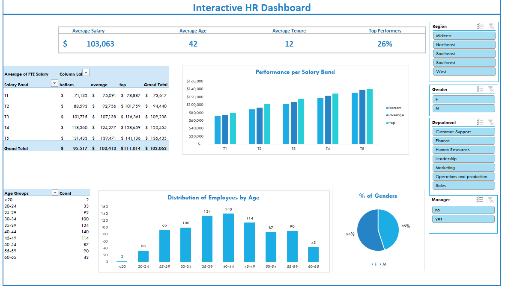
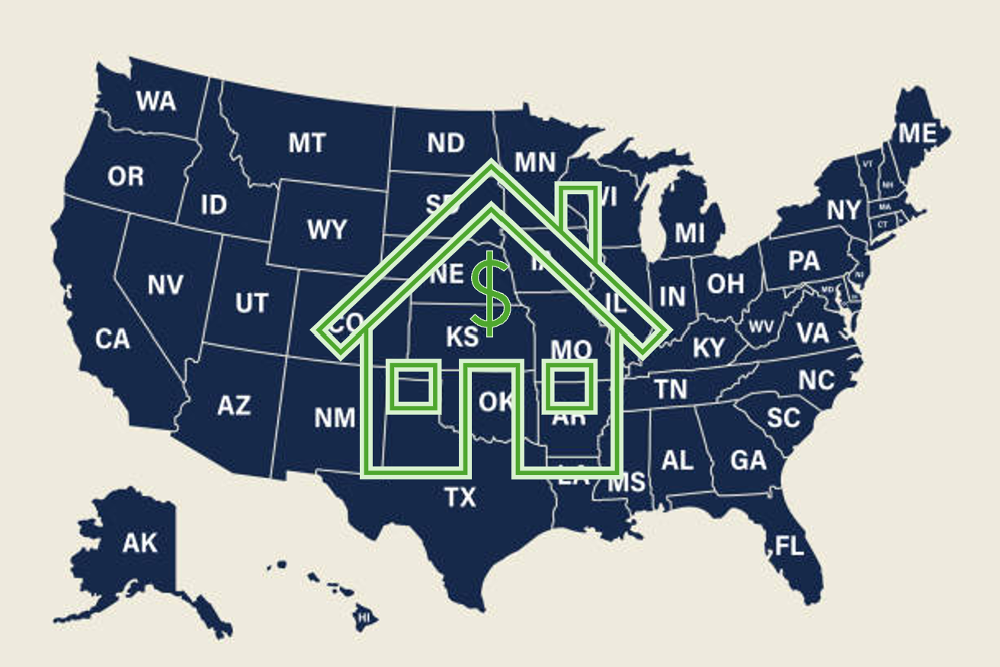

## Hi there 👋

I'm an experienced People Operations professional with expertise in HR operations, systems implementation, and process optimization. I thrive at the intersection of operations and technology, building scalable solutions that enhance efficiency, strengthen processes, and elevate the employee experience.

### Skills Overview

🔸**Strategic project management leadership demonstrated** through company-wide HR system rollouts and process automation initiatives, overseeing timelines, stakeholder alignment, and execution to simplify workflows, build practical systems, and strengthen collaboration across teams.

🔸**Strong analytical and reporting skills** shown through the creation of dashboards and workforce metrics that provide leadership with clear insights for data-driven decision-making and organizational planning.

🔸**Innovative process improvement mindset** applied to redesigning onboarding and HR workflows that not only reduced onboarding time but also standardized processes, creating scalable systems across the organization.

🔸**Effective collaborator** skilled at building trust and aligning HR, Finance, and IT to drive cross-functional initiatives that strengthen connection and consistency across the organization.

| Skills Overview |.| 
| :---         |     :-------------------     | 
|  **Strategic project management leadership**  | **Strong analytical and reporting skills**     | 
| Demonstrated through company-wide HR system rollouts and process automation initiatives, overseeing timelines, stakeholder alignment, and execution to simplify workflows, build practical systems, and strengthen collaboration across teams.     | Shown through the creation of dashboards and workforce metrics that provide leadership with clear insights for data-driven decision-making and organizational planning.       | 
|**Innovative process improvement mindset**|	**Effective collaborator**|
|Applied to redesigning onboarding and HR workflows that not only reduced onboarding time but also standardized processes, creating scalable systems across the organization. | Skilled at building trust and aligning HR, Finance, and IT to drive cross-functional initiatives that strengthen connection and consistency across the organization. |

### Projects

|[HR Performance Dashboard](https://github.com/Elizabeth-CJ/HR-Performance-Dashboard)| [US Household Income Data Analysis](https://github.com/Elizabeth-CJ/US-Household-Income) | [Customer Churn Rate Dashboard](https://public.tableau.com/shared/MQRGC85DG?:display_count=n&:origin=viz_share_link)|
|    :---:     |     :---:      |     :---:     |
|  |    |    |
| This project is an exploratory HR dashboard built in Excel to analyze employee demographics, performance, and compensation patterns.    | This project analyzes US household income data using MySQL for data cleaning, transformation, and exploration       |    Interactive Tableau dashboard exploring customer churn trends based on tenure, contract type, and monthly charges in the telecom industry.    |

